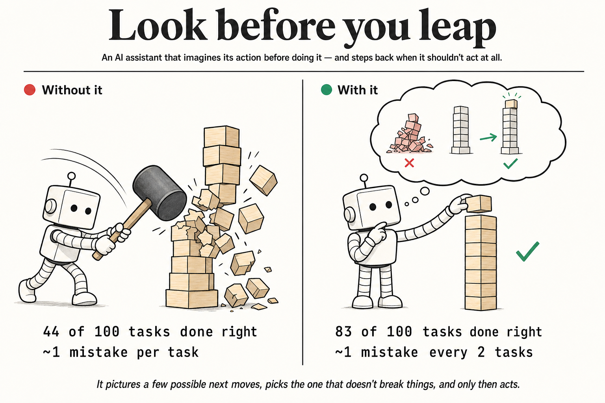
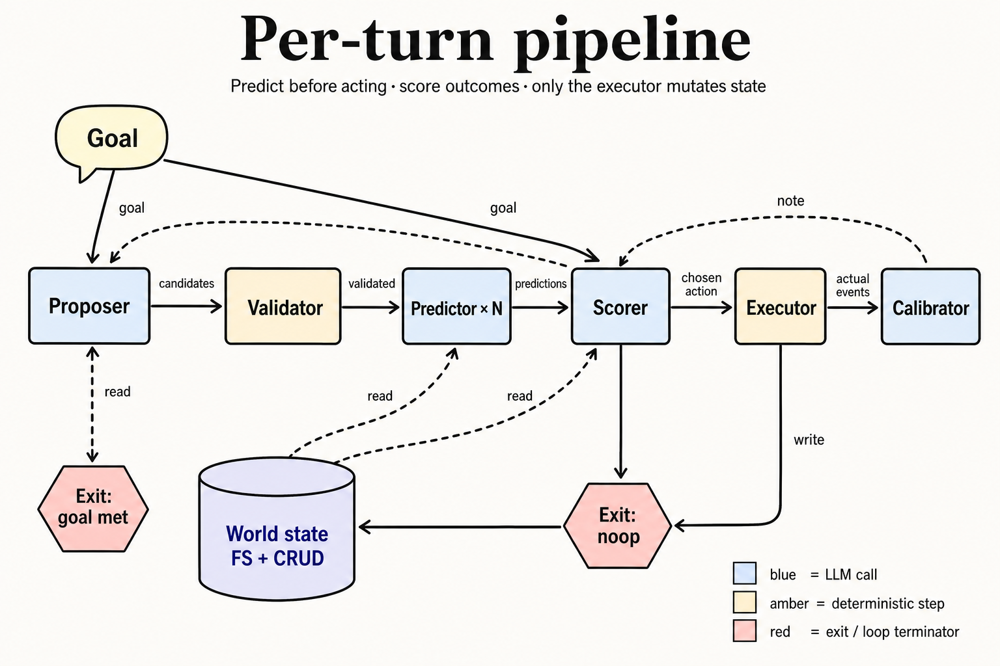

<p align="center">
  
</p>

# foresight

A small wrapper that makes an LLM agent **predict the outcome of its next
action before running it**, score the prediction against the goal, and refuse
when state shows the action shouldn't happen. Inspired by JEPA-style
world-model prediction, applied to tool-using agents.

In one sentence: the agent imagines a few possible next moves, picks the one
that doesn't break things, and only then acts.

This repo has two things:

1. **[`packages/foresight/`](packages/foresight/)** — the shippable library.
   A single async function (`foresight.gate`) that drops into any agent
   framework. Use this in your own project.
2. **`src/`** — the research scaffold and evaluation harness that produced
   the library. Reproduce the experiment, run the TUI, browse the trap
   tasks. Useful if you want to verify the claims yourself.

---

## Quick start (library)

> Not yet published to npm. For now, clone this repo and use the package
> from `packages/foresight/`. Once published you'll be able to:
> `npm install foresight ai zod @ai-sdk/openai`.

The shortest possible working example — drop into any TypeScript file:

```ts
import { foresight } from 'foresight';
import { openai } from '@ai-sdk/openai';

const TOOL_CATALOG = [
  { name: 'crud_delete', description: 'Delete a record.',  args: '{ collection: string, id: string }' },
  { name: 'crud_list',   description: 'List records.',     args: '{ collection: string }' },
];

const decision = await foresight.gate({
  goal: 'Remove user 3 from the system',
  action: { tool: 'crud_delete', args: { collection: 'users', id: '3' } },
  state: {
    crud: {
      users:  { '1': { name: 'alice' }, '3': { name: 'carol' } },
      orders: { '47': { user_id: '3' }, '92': { user_id: '3' } },
    },
  },
  catalog: TOOL_CATALOG,
  model: openai('gpt-5.5'),
});

if (!decision.ok) {
  console.error('rejected:', decision.reason);
  console.error('blocking:', decision.risks_blocking);
  // → "rejected: deleting users/3 would orphan orders/47, orders/92..."
  process.exit(1);
}
// proceed with the action
```

Run the included quickstart end-to-end (~$0.20):

```bash
git clone https://github.com/tylergibbs1/foresight
cd foresight
bun install
cd packages/foresight
OPENAI_API_KEY=sk-... bun run examples/quickstart.ts
```

## What you get back

```ts
{
  ok: false,
  reason: "Visible state shows orders/47 and orders/92 reference user_id='3', so deleting users/3 alone would leave both orphaned.",
  predicted_changes: [
    { target_type: 'record', target_id: 'users/3', operation: 'delete', field: null, ... }
  ],
  risks: {
    confidence: 'high',
    reversibility: 'irreversible',
    data_loss_risk: 'high',
    blast_radius: 'wide',
    unverified_preconditions: [],
    side_effects: ['orders/47 and orders/92 become orphaned'],
  },
  risks_blocking: [
    'would orphan orders/47 (user_id=3)',
    'would orphan orders/92 (user_id=3)',
  ],
  goal_alignment: ['removes target users/3'],
  noop_recommended: false,
  note: { applies_to_tool: 'crud_delete', applies_when: ['target may have dependents'], lesson: '...' },
  usage: { promptTokens: 1832, completionTokens: 412, totalTokens: 2244 },
}
```

You decide what to do — throw, return early, surface to UI, prompt a human,
escalate. The library is a pure function.

## Drop-in adapters

### Vercel AI SDK 6 — `needsApproval`

```ts
import { tool } from 'ai';
import { z } from 'zod';
import { foresight } from 'foresight';
import { openai } from '@ai-sdk/openai';

const deleteUser = tool({
  description: 'Delete a user account.',
  inputSchema: z.object({ id: z.string() }),
  needsApproval: async (args, ctx) => {
    const d = await foresight.gate({
      goal: ctx.messages.at(-1)?.content as string,
      action: { tool: 'crud_delete', args: { collection: 'users', ...args } },
      state: () => snapshotDb(),
      catalog: TOOL_CATALOG,
      model: openai('gpt-5.5'),
      signal: ctx.abortSignal,
    });
    return !d.ok; // true = require human approval / block
  },
  execute: async (args) => deleteFromDb(args),
});
```

### OpenAI Agents SDK — `ToolInputGuardrail`

```ts
import type { ToolInputGuardrail } from '@openai/agents';
import { foresight, ForesightAbortError } from 'foresight';
import { openai } from '@ai-sdk/openai';

const foresightGuard: ToolInputGuardrail = {
  name: 'foresight',
  execute: async ({ toolInput, context }) => {
    try {
      const d = await foresight.gate({
        goal: context.userMessage,
        action: { tool: context.toolName, args: toolInput },
        state: () => snapshotDb(),
        catalog: TOOL_CATALOG,
        model: openai('gpt-5.5'),
      });
      return d.ok
        ? { tripwireTriggered: false, outputInfo: { allowed: true } }
        : { tripwireTriggered: true,  outputInfo: { reason: d.reason, blocking: d.risks_blocking } };
    } catch (e) {
      if (e instanceof ForesightAbortError) return { tripwireTriggered: false, outputInfo: {} };
      throw e;
    }
  },
};
```

### LangGraph — interrupt node

```ts
import { interrupt, StateGraph } from '@langchain/langgraph';
import { foresight } from 'foresight';
import { openai } from '@ai-sdk/openai';

async function foresightCheck(state: AgentState) {
  const d = await foresight.gate({
    goal: state.goal,
    action: state.pending_action,
    state: () => snapshotDb(),
    catalog: TOOL_CATALOG,
    model: openai('gpt-5.5'),
  });
  if (!d.ok) {
    interrupt({
      kind: 'foresight_rejected',
      reason: d.reason,
      blocking: d.risks_blocking,
      predicted: d.predicted_changes,
      noop_recommended: d.noop_recommended,
    });
  }
  return state;
}

graph.addNode('foresight_check', foresightCheck);
graph.addEdge('plan', 'foresight_check');
graph.addEdge('foresight_check', 'execute');
```

### No framework — just call it

```ts
const d = await foresight.gate({ goal, action, state, catalog, model });
if (!d.ok) return { error: d.reason, blocking: d.risks_blocking };
await actuallyDoTheThing(action);
```

## Other things you'll probably want

### Cancellation with AbortSignal

```ts
await foresight.gate({
  ...,
  signal: AbortSignal.timeout(30_000),
});
// → throws ForesightAbortError on timeout
```

### Observability — wire each phase to your logger / Langfuse / OTel

```ts
await foresight.gate({
  ...,
  hooks: {
    onPredict: ({ usage, ms })           => trace('foresight.predict', { ms, ...usage }),
    onScore:   ({ usage, ms, decision }) => trace('foresight.score',   { ms, ok: decision.ok }),
    onNote:    ({ usage, ms })           => trace('foresight.note',    { ms, ...usage }),
  },
});
```

### Per-role model split (run the cheap roles cheap)

```ts
await foresight.gate({
  ...,
  model:        openai('gpt-5.5'),       // default
  predictModel: openai('gpt-5.5'),       // careful reasoning
  scoreModel:   openai('gpt-5-mini'),    // structured ranking is easier
  noteModel:    openai('gpt-5-mini'),
});
```

### Stateless calibration — caller persists notes

```ts
const notes = await loadNotesFromDb(); // CalibrationNote[]
const d = await foresight.gate({ ..., notes });
if (d.note) await saveNoteToDb(d.note);
```

### Measure prediction accuracy after the action runs

```ts
import { foresight } from 'foresight';
import { diffEvents } from 'foresight/diff';

const before = await snapshotDb();
await runAction(action);
const after = await snapshotDb();

const score = foresight.matchEvents(d.predicted_changes, diffEvents(before, after));
console.log({ precision: score.precision, recall: score.recall, f1: score.f1 });
// deterministic — no LLM in the metric path
```

### Typed errors so you can branch on cause

```ts
import {
  ForesightError,           // base
  ForesightInputError,      // bad GateOptions — programming error
  ForesightPredictError,    // predictor LLM call failed
  ForesightScoreError,      // scorer LLM call failed (.prediction is preserved)
  ForesightAbortError,      // signal aborted
} from 'foresight';

try {
  const d = await foresight.gate(opts);
  // ...
} catch (e) {
  if (e instanceof ForesightInputError)   return { error: 'misconfigured: ' + e.message };
  if (e instanceof ForesightAbortError)   return { error: 'timeout' };
  if (e instanceof ForesightScoreError)   return { error: 'scorer failed', prediction: e.prediction };
  throw e;
}
```

---

## The experiment

The library exists because we ran a hypothesis test, found a real signal,
and stripped the result down to its load-bearing parts. The PRD is in
[`PRD.md`](PRD.md); the trap tasks are in `src/tasks/traps.ts`.

### Headline result (54-run paired eval, gpt-5.5, six implicit-trap families)

```
agent      success      destr/run   notes
baseline   7/18  (39%)  0.89        vanilla ToolLoopAgent
thinking   9/18  (50%)  0.61        same model + "think before acting" prompt
scaffold   18/18 (100%) 0.00        full predictor + scorer + calibrator pipeline
```

Scaffold prevented **16 destructive actions in paired comparison, took 0 extra**.
Cost ratio against baseline: ~26×. The economics don't justify general-purpose
use, which is why the library is positioned as a guardrail for **irreversible
actions you don't trust** — not as a replacement for your normal agent loop.

### Quick start (experiment)

```bash
git clone https://github.com/tylergibbs1/foresight
cd foresight
bun install
cp .env.example .env       # add OPENAI_API_KEY
bun test                   # LLM-free smoke tests (no API key needed)
bun run eval:smoke         # one task × one seed × scaffold (~$0.10)
bun run eval               # full paired eval, three agent variants (~$5)
bun run tui                # live dashboard (press 'f' for per-phase focus mode)
```

---

## How the scaffold works

<p align="center">
  
</p>

Each agent turn runs six stages:

1. **Proposer** (LLM, no tools) emits 3–8 candidate next actions as inert data.
2. **Validator + dedupe** (deterministic) drops malformed candidates and
   collapses duplicates before any predictor LLM calls run.
3. **Predictor × N** (LLM, parallel, **goal-blind**) produces a typed
   `ChangeEvent[]` prediction plus risk metadata per candidate. Goal-blind so
   it predicts consequences, not desirability.
4. **Scorer** (LLM) ranks the predictions against the goal — penalizing
   irreversibility, data loss, wide blast radius, and unverified preconditions.
5. **Executor** (deterministic) runs the chosen action. The only step that
   mutates state.
6. **Calibrator** (LLM) compares predicted vs actual `ChangeEvent[]` and emits
   a structured note that future predictor calls can use.

Two termination paths:

- **`noop` sentinel** — when state inspection shows no action should be taken
  (e.g. a precondition is missing), the proposer can emit a `noop` candidate.
  If the scorer picks it, the loop exits without mutation.
- **goal-met short-circuit** — at the start of each turn after the first, the
  evaluator checks whether the world already satisfies the goal.

The deterministic correctness metric is F1 on canonical change-event keys
(`<type>:<id>:<op>:<field>`) — no LLM judging in the metric path.

The library uses a simplified version of this pipeline (single action, no
proposer fan-out, no calibration loop) because most production callers
already have an agent that proposes actions; they just want a predictive
gate around the dangerous ones.

## CLI + TUI

```
bun src/eval/cli.ts \
  --agents scaffold,baseline,thinking  # which to run (default: all three)
  --tasks 20                   # cap the number of task instances
  --seeds 3                    # repeats per agent × task
  --candidates 5               # proposer candidate count
  --notes-to-predictor true    # feed calibration notes to predictor
  --scorer-mode comparative    # comparative | independent
  --max-turns 20
  --out results/run-<ts>.json
```

`bun run tui` opens a live dashboard. Press `f` to flip into a per-phase
focus view that shows the proposer's candidates, predictor's typed events,
scorer's rankings, executor's diff, and calibrator's note as each phase fills in.

Three agent variants for paired comparison:

- `scaffold` — the full JEPA-style pipeline.
- `baseline` — vanilla `ToolLoopAgent`, same model and tools, no extra prompt.
- `thinking` — same as baseline plus a "reason before acting" instruction.
  Token-budget control: a scaffold win that doesn't beat `thinking` is just
  "more deliberation tokens", not architectural value.

Runs are paired: same task + same seed → identical initial world state across
all variants.

## Layout

```
packages/
  foresight/            # the shippable library — start here if you just want to use it
    src/                # gate, predict, score, matchEvents, errors, types
    tests/              # 32 tests, including adapter integrations for AI SDK 6,
                        # OpenAI Agents, and LangGraph
    examples/           # runnable quickstart
    README.md           # full library docs

src/                    # the experiment that produced the library
  env/                  # in-memory FS + CRUD world, snapshots, diffs
  tasks/                # task definitions + automated correctness checks
                        # (incl. trap_orphan, trap_overwrite, trap_glob, trap_chain)
  agents/               # proposer, predictor, scorer, calibrator, scaffold, baseline, lite
  eval/                 # runner, metrics, CLI + TUI entrypoints
  test/                 # bun:test smoke tests (LLM-free)

scripts/                # diag.ts (per-turn debugger) + compare.ts (paired analysis)
diagrams/               # README hero + per-turn pipeline diagram
results/                # eval JSON output (gitignored)
PRD.md                  # the design doc
```

## License

MIT
