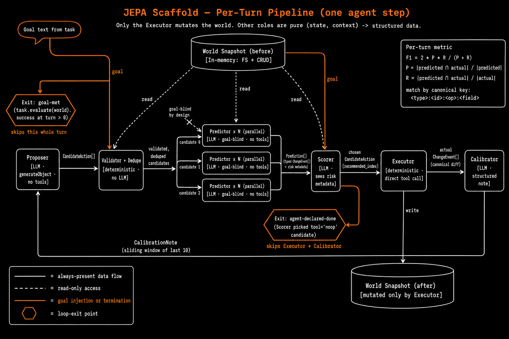

<p align="center">
  
</p>

# foresight

A small wrapper around an LLM agent that makes it **predict the outcome of its
next action before running it**, score the predictions, and only execute the
action that matches the safest predicted outcome. Inspired by JEPA-style
world-model prediction, applied to tool-using agents.

In one sentence: the agent imagines a few possible next moves, picks the one
that doesn't break things, and only then acts.

## Quick start

```bash
bun install
cp .env.example .env       # add OPENAI_API_KEY
bun test                   # LLM-free smoke tests (no API key needed)
bun run eval:smoke         # 1 task × 1 seed × scaffold only (~$0.10)
bun run eval               # full paired eval, three agent variants
```

## How it works

<p align="center">
  
</p>

Each agent turn runs six stages, in this order:

1. **Proposer** (LLM, no tools) emits 3–8 candidate next actions as inert data.
2. **Validator + dedupe** (deterministic) drops malformed candidates and
   collapses duplicates before any predictor LLM calls run.
3. **Predictor × N** (LLM, parallel, **goal-blind**) produces a typed
   `ChangeEvent[]` prediction plus risk metadata for each candidate. Goal-blind
   so it predicts consequences, not desirability.
4. **Scorer** (LLM) ranks the predictions against the goal — penalizing
   irreversibility, data loss, wide blast radius, and unverified preconditions.
5. **Executor** (deterministic) runs the chosen action against the world. The
   only step that mutates state.
6. **Calibrator** (LLM) compares predicted vs actual `ChangeEvent[]` and emits
   a structured note that future predictor calls can use.

Two termination paths:
- **`noop` sentinel** — when state inspection shows no action should be taken
  (e.g. a precondition is missing), the proposer can emit a `noop` candidate.
  If the scorer picks it, the loop exits without mutation.
- **goal-met short-circuit** — at the start of each turn after the first, the
  evaluator checks whether the world already satisfies the goal.

The deterministic correctness metric is F1 on canonical change-event keys
(`<type>:<id>:<op>:<field>`) — no LLM judging in the metric path.

## CLI

```
bun src/eval/cli.ts \
  --agents scaffold,baseline,thinking  # which to run (default: all three)
  --tasks 20                   # cap the number of task instances (default: all)
  --seeds 3                    # repeats per agent×task (default: 3)
  --candidates 5               # proposer candidate count (default: 5)
  --notes-to-predictor true    # feed calibration notes to predictor (default: true)
  --scorer-mode comparative    # comparative | independent (default: comparative)
  --max-turns 20               # turns per task (default: 20)
  --out results/run-<ts>.json
```

Also: `bun run tui` for a live dashboard, with `f` to toggle into a per-phase
focus view that shows the proposer's candidates, predictor's typed events,
scorer's rankings, executor's diff, and calibrator's note as each phase fills in.

Three agent variants:
- `scaffold` — the JEPA-style pipeline.
- `baseline` — vanilla `ToolLoopAgent`, same model and tools, no extra prompt.
- `thinking` — same as baseline plus a "reason before acting" instruction.
  Token-budget control: a scaffold win that doesn't beat `thinking` is just
  "more deliberation tokens".

Runs are paired: same task + same seed → identical initial world state across
all variants.

## Deviations from PRD

Simplifications for phase 1; none change the experiment's shape.

- **In-memory FS** instead of `/tmp/jepa-test-<uuid>/`. The model still sees a
  filesystem-shaped tool catalog (`read_file`, `write_file`, `list_files`,
  `delete_file`, `move_file`); whether bytes live on disk or in a `Map` doesn't
  change what we're measuring. Deterministic and parallel-safe.
- **In-process CRUD store** instead of `Bun.serve`. The agent reaches it via
  tool calls, not HTTP, so the server adds nothing.
- **Direct executor** instead of a `ToolLoopAgent` for the executor role. The
  scaffold already chose the action; routing through another LLM step injects
  variance for no benefit.
- **Prompts as TS strings** in `src/agents/prompts.ts` instead of separate `.md`
  files. Easier to evolve alongside the schemas they pair with.

## Layout

```
src/
  env/      # World (fs + crud), snapshots, diffs, AI SDK tool factory
  tasks/    # Task definitions + automated correctness checks (incl. trap_*)
  agents/   # proposer, predictor, scorer, calibrator, scaffold, baseline
  eval/     # runner, metrics, correctness scoring, CLI + TUI entrypoints
  test/     # bun:test smoke tests (LLM-free)
results/    # JSON output, gitignored
diagrams/   # README hero + per-turn pipeline diagram
```
